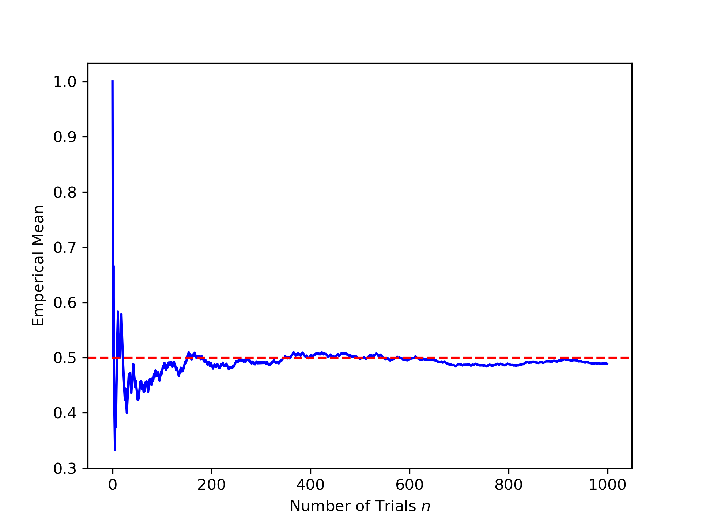

# 1. Coin Flipping

We have used the example of flipping a fair coin many times in the previous sections. Formally, the event of landing heads or tails can be represented as a Bernoulli random variable $B$. Only two values can be taken on by this variable: `1` or `0`. The latter is associated with _success_, that some event has occurred, while the former conveys _failure_ of said event to happen. For example, a Bernoulli random variable $B$ may be defined to represent the outcome of flipping a fair coin to land on heads. In this case, $B=1$ when the coin lands on heads and $B=0$ when it does not. More generally, Bernoulli variables represent the occurrence of events where the outcome is binary, and there is a fixed probability $p$ of success. A semi-formal definition is as follows,

{: .highlight}
**Definition:**  A random variable $B$ is Bernoulli distributed with parameter $p$, written $B \sim \mathrm{Bernoulli}(p)$, if
$\Pr(B=1)=p$ and $\Pr(B=0)=1-p=q$ where $0 \leq p \leq 1$ is the probability of the success.

One can also construct a probability mass function (PMF) $P(B=\beta)$ for a Bernoulli variable,

$P(B=\beta) = p^{\beta}(1-p)^{1-\beta}$

When $\beta=1$ (we select the probability of success), it is clear that $P(B=1) = p^{1}(1-p)^{0}=p$. Conversely, the probability of is $P(B=0) = p^{0}(1-p)=1-p$. Using this PMF, it can be shown that the expected value of a Bernoulli distributed variable $B$ is $\mathbf{E}[B] = p$. With $\mathbf{E}[B]$, one can also find the variance to be $\text{var}(B) = p(1-p)$.

